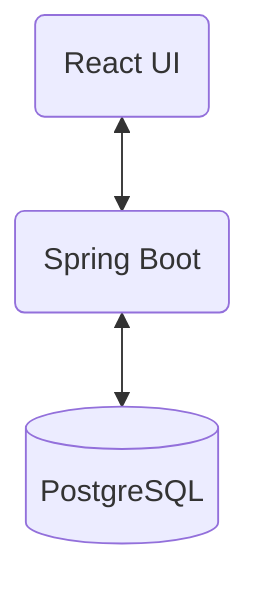

# 📑 API Document Project

> **코틀린 기반의 효율적인 프로젝트 연동 규격서 관리 시스템**  
> 프로젝트별로 흩어진 API 명세와 연동 규격을 한눈에 관리하고 공유하기 위한 어드민 서비스입니다.

---

## 🛠 Tech Stack

### Backend
- **Language**: Kotlin 1.9.22 (JVM 20)
- **Framework**: Spring Boot 3.2.2
- **Build Tool**: Gradle (Kotlin DSL)
- **ORM**: Spring Data JPA
- **Database**: PostgreSQL
- **Migration**: Flyway
- **API Documentation**: Springdoc OpenAPI (Swagger) 2.3.0

### Frontend
- **Library**: React 18
- **UI Framework**: Material UI (MUI)
- **State & Communication**: Axios, React Router Dom
- **Design System**: Teal & Blue Grey Modern Dashboard Style

### Infrastructure
- **Container**: Docker, Docker Compose

---

## 🏗 System Architecture



- **Layered Architecture**: 관심사 분리를 위해 Controller, Service, Repository, Entity 계층으로 나누어 설계하였습니다.
- **Global Exception Handling**: `CustomException`과 `GlobalExceptionHandler`를 통해 일관된 에러 응답 구조를 제공합니다.
- **CORS Configuration**: 프론트엔드(Port 3000)와 백엔드(Port 8080) 간의 원활한 통신을 위한 설정이 완료되었습니다.

---

## ✨ Key Features & Roadmap

### 👤 User & Admin (사용자 및 관리자)
- [x] **회원가입**: 새로운 관리자/사용자 계정 생성
- [ ] **로그인/로그아웃**: JWT 기반 인증 및 권한 부여
- [ ] **권한 관리**: Admin / User 등급별 접근 제어

### 📦 Project Management (프로젝트 관리)
- [x] **프로젝트 대시보드**: React 기반의 모던한 UI 구현
- [x] **프로젝트 등록/조회/수정/삭제**: CRUD 기능 완벽 연동
- [x] **통합 검색**: 프로젝트 명칭 및 설명을 기반으로 한 실시간 필터링
- [ ] **프로젝트 상태 관리**: 운영 / 종료 / 테스트 상태별 필터링

### 🔗 API Specification (연동 규격서 관리 - 예정)
- [ ] **API 명세 등록**: Method, Header, Body, Response 값 상세 기록
- [ ] **인증 방식 관리**: 프로젝트별 API 키, OAuth 등 인증 정보 기록
- [ ] **버전 관리**: API 규격 변경 이력 추적 및 히스토리 관리

### 🚀 Advanced Features (추후 고도화 계획)
- [ ] **문서 내보내기/가져오기**: PDF, Markdown, Swagger(JSON/YAML) 포맷 변환 지원
- [ ] **Mock Server 지원**: 정의된 응답 규격을 기반으로 가상 응답(Mock Response) 자동 생성
- [ ] **협업 도구 연동**: API 변경 시 Slack/Email 알림 발송 및 코멘트 기능
- [ ] **보안 감사(Audit Log)**: 누가 언제 어떤 규격을 수정했는지 이력 추적

---

## 🚀 Getting Started

### 1. Prerequisites
- Docker & Docker Compose
- JDK 20+
- Node.js & npm

### 2. Database 실행
```bash
docker-compose up -d
```

### 3. Backend 실행
```bash
./gradlew bootRun
```

### 4. Frontend 실행
```bash
cd api-document-ui
npm install
npm start
```
- 프론트엔드는 `http://localhost:3000`에서 확인 가능합니다.

---

## 📖 API Documentation (Swagger)

백엔드 실행 후 아래 주소에서 인터랙티브한 API 명세서를 확인할 수 있습니다.
- **URL**: [http://localhost:8080/swagger-ui/index.html](http://localhost:8080/swagger-ui/index.html)

---

## 👤 Member
- **허유림 (HeoYurim)** - Backend & Frontend Developer
- **Email**: mh10v2@naver.com
- **GitHub**: [HeoYurim](https://github.com/HeoYurim)
